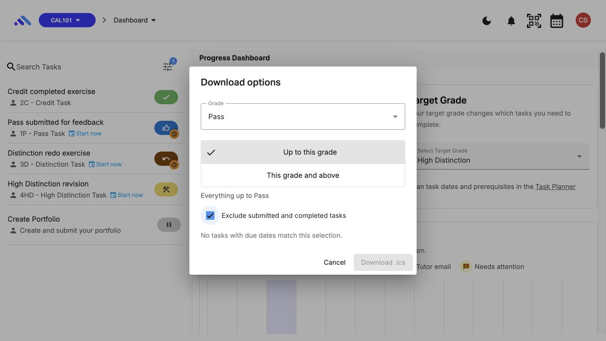
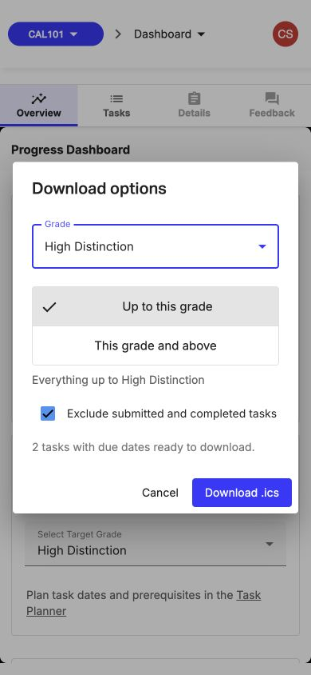

# CAL-A01: Calendar accessibility verification

## Changes and automated evidence

The download options dialog focuses its first control (Grade) when it opens. Material supplies the focus trap, Escape handling and focus restoration. The result count and empty-result message share a persistent `role="status"` region, so changing a filter can announce whether a download is available. Decorative icons are hidden from the accessibility tree.

The Web calendar switch, loading spinner and reminder save/cancel actions have explicit accessible names. Included units use ordinary chips with named native removal buttons; the add-unit menu has a visible **Add unit** button. These actions retain their saving guards. The subscription link, copy and regenerate controls retain their separate names and behaviors.

`calendar-modal.component.spec.ts` renders the actual Material chips, menu trigger and switch and checks names, removal activation and disabled states. `download-filter-dialog.component.spec.ts` checks the live result region and empty state. `task-planner-card.component.spec.ts` checks the initial-focus configuration along with the grade/status/date download guards.

These are DOM/component checks. They do not establish screen-reader output, rendered contrast, browser Tab order or a completed manual accessibility audit.

## Observed keyboard pass — 21 September 2026

The real local application was exercised through keyboard input in the Codex in-app Chromium browser at web `283b49336`, using the [synthetic fixture](calendar/evidence-20260921/environment.md). This was an agent-operated UI pass, not a human screen-reader audit.

- Enter on **Download .ics** opened the dialog with focus on **Grade**. Home and arrow keys selected the grades; Space changed the grade range and exclusion checkbox.
- Tab moved from Grade to the selected grade-range radio, then the exclusion checkbox, then Cancel. With a valid result the Download button was available.
- Pass / Up to this grade / exclusion on produced the empty message and disabled Download. Tab from Cancel skipped that disabled button and wrapped to Grade.
- Escape, Cancel and a successful download returned focus to the dashboard's **Download .ics** opener.
- In Web calendar, the first loading state focused Close. Tab reached **Enable web calendar** after loading; Space enabled it. Saving temporarily disabled the affected controls. Unit removal and the Add unit menu were keyboard operable.
- At a 390 × 844 viewport, all download options and both action buttons were visible without horizontal clipping. The normal viewport was restored afterward.

No screen reader was run and no recording was captured. Accessibility-tree text is not evidence that a screen reader announced it. The Mac locked before the native-app portion could be completed. **CAL-A01 remains open** for the screen-reader session and recording, plus the unchecked items below.

## Remaining validation

Use synthetic student data. Record browser, OS and screen-reader versions, date, viewport and the commit tested. Do not put real subscription tokens in recordings.

1. Tab to **Download .ics**, press Enter and confirm Grade receives focus. Change each grade with the keyboard, change Grade range and the submission checkbox, and confirm the count is announced once after each change.
2. Select a zero-result combination. Confirm the explanation is announced and Download is disabled. Restore a valid selection and download with Enter/Space.
3. Open again and press Escape. Confirm focus returns to **Download .ics**. Repeat using Cancel.
4. Open Web calendar and toggle it with Space. Confirm the enabled/disabled state is announced. Navigate unit removal, Add unit, reminders, subscription link, Copy, Regenerate, Download a copy and Close without a pointer.
5. Trigger a save and verify disabled controls cannot activate. Check confirmation dialog focus and return focus after cancellation.
6. Repeat at 200% zoom and a phone-width viewport. Check focus visibility, scrolling and no horizontal clipping. Repeat in the supported light/dark themes.

The checklist above is the full repeatable procedure; the observations in the preceding section identify the portions already exercised. The 200% zoom, theme variants, full WebCal control traversal, confirmation focus and spoken announcements remain unverified. Add the recording and actual observations before marking the ticket complete.
