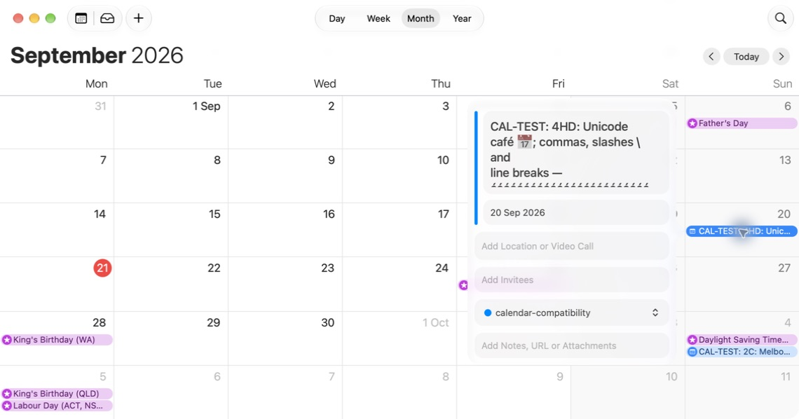
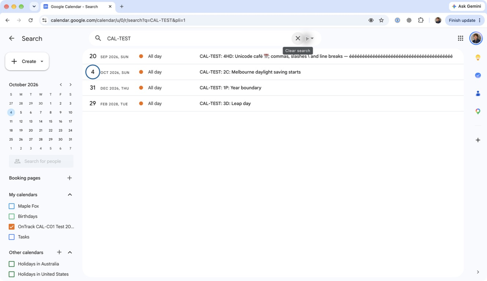
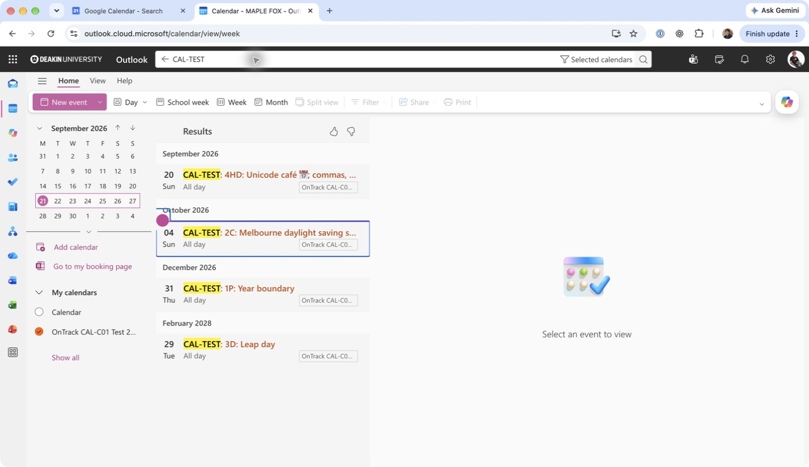

# CAL-C01: Calendar compatibility evidence

**CAL-C01 is complete.** The four-event fixture was imported and checked in Apple Calendar, Google Calendar and Outlook on the web on 21 September 2026. All three showed the intended single all-day dates. Client-specific Unicode/newline display behavior is recorded below.

## Reproducible fixture

[calendar-compatibility.ics](calendar/calendar-compatibility.ics) is generated by the production frontend `buildIcsCalendar` function using synthetic tasks and a fixed `DTSTAMP` of 2026-09-20 00:00 UTC. It contains no account, subscription token or real student information.

| UID      | Expected title/details                                                            | Expected all-day date | Exclusive end     |
| -------- | --------------------------------------------------------------------------------- | --------------------- | ----------------- |
| E-900001 | CAL-TEST: 1P: Year boundary                                                       | 31 December 2026      | 1 January 2027    |
| E-900002 | CAL-TEST: 2C: Melbourne daylight saving starts                                    | 4 October 2026        | 5 October 2026    |
| E-900003 | CAL-TEST: 3D: Leap day                                                            | 29 February 2028      | 1 March 2028      |
| E-900004 | Unicode café, calendar emoji, escaped punctuation, newline and long Unicode title | 20 September 2026     | 21 September 2026 |

The automated frontend suite covers civil-date preservation at leap-year, daylight-saving and year boundaries; CRLF line endings; 75-octet UTF-8 folding; escaping; stable task-definition UIDs; invalid-date exclusion; and every grade range. See [CAL-T01](CAL-T01-test-coverage.md) for the exact test command and results.

To regenerate the fixture from a dependency-installed checkout:

```sh
node_modules/.bin/esbuild src/app/api/services/ics-calendar-builder.ts --bundle --platform=node --format=cjs --outfile=/tmp/ontrack-calendar-builder.cjs
node docs/calendar/generate-fixture.cjs /tmp/ontrack-calendar-builder.cjs
```

The generator supplies only synthetic task objects; the real event/date/escaping logic comes from the compiled production builder. Its timestamps and dates are fixed, so regenerating the file should produce no diff. A local `.gitattributes` entry preserves the fixture's required CRLF line endings in Git.

## Client results recorded on 21 September 2026

The four-event compatibility fixture was imported into real calendar applications. This is separate from the [six CAL101 option-filter downloads](calendar/evidence-20260921/exports/README.md), which demonstrate grade and submitted-task filtering.

| Client | Import result | Date and text verification | Evidence |
| --- | --- | --- | --- |
| Apple Calendar | Four fixture events imported | All four appeared on the intended all-day dates, without an extra day; Unicode title value checked through native accessibility text | Native Calendar screenshots below |
| Google Calendar | Application reported 4 of 4 events imported; all four original events verified | Exactly four results on the intended single all-day dates; Unicode and punctuation retained, with the newline displayed as a space | Search, daylight-saving and Unicode screenshots below |
| Outlook Calendar | Import confirmation observed; selected-calendar search returned exactly four events | All four had the intended single all-day date; Unicode and punctuation retained with client-specific newline display normalization | Four-event search screenshot and text observations below |

The Apple test used **Calendar 27.0 (3073)** on **macOS 27.0**, with the system timezone set to **Australia/Melbourne**. The Google import and follow-up verification used **Chrome 153.0.8010.48** on **macOS 27.0**. Its day grid displayed **GMT+10**; the Google Calendar account's configured timezone was not confirmed, so this report does not claim a Melbourne timezone setting for Google. Outlook on the web was also tested in native Chrome on macOS 27.0; its account's configured timezone was not confirmed. These are observed all-day civil-date results, not a claim about either web client's configured timezone.

### Apple Calendar observations

| Fixture case | Observed all-day date | Screenshot |
| --- | --- | --- |
| Unicode, escaped punctuation and long title | 20 September 2026 | [Unicode event](calendar/evidence-20260921/apple-unicode.png) |
| Melbourne daylight-saving start | 4 October 2026 | [Daylight-saving event](calendar/evidence-20260921/apple-dst.png) |
| Year boundary | 31 December 2026 | [Year-boundary event](calendar/evidence-20260921/apple-year-boundary.png) |
| Leap day | 29 February 2028 | [Leap-day event](calendar/evidence-20260921/apple-leap-day.png) |

Each event occupied its intended day rather than continuing into an additional day. The Unicode event retained its complete title in the native accessibility value, including the accented text, emoji, punctuation, backslash and line break. Its long title is visibly truncated by the event-detail viewport; the screenshot therefore does not show the entire title at once.



### Google Calendar observations

The original import reported **Imported 4 out of 4 events** in **OnTrack CAL-C01 Test 2026-09-21**. Before the detailed checks, one accidentally deleted synthetic event was restored from that dedicated calendar's Trash. The original imported events were then verified without re-importing or creating duplicates.

On 21 September 2026, searching for `CAL-TEST` returned exactly four results. Each result was labelled **All day** and showed only the intended single date:

| Fixture case | Observed all-day date |
| --- | --- |
| Unicode, escaped punctuation and long title | 20 September 2026 |
| Melbourne daylight-saving start | 4 October 2026 |
| Year boundary | 31 December 2026 |
| Leap day | 29 February 2028 |



The daylight-saving event's [day view and detail popup](calendar/evidence-20260921/google-dst.png) confirmed 4 October. The Unicode event's complete accessible name retained **café**, the calendar emoji, comma, semicolon, literal backslash and all 40 trailing **é** characters. Google's UI displayed the embedded newline as a space. The [detail popup](calendar/evidence-20260921/google-unicode.png) visually shortened the long title with an ellipsis; the complete accessible name was checked separately.

Only the dedicated test calendar was enabled during verification. The seven original calendar visibility settings were restored afterwards. The retained captures show synthetic test-event content and no private email addresses.

### Outlook Calendar observations

On 21 September 2026, a blank calendar named **OnTrack CAL-C01 Test 2026-09-21** was created in the existing enterprise Outlook web application. The creation UI identified the new calendar as not visible to other people. **Upload from file** imported the same `calendar-compatibility.ics` fixture into that calendar, and Outlook displayed a successful import confirmation naming the file and destination. The attempted toast screenshot did not capture that confirmation and is not included as evidence.

With only the test calendar selected, searching **Selected calendars** for `CAL-TEST` returned exactly four events. Each result was labelled **All day** and showed one date:

| Fixture case | Observed all-day date |
| --- | --- |
| Unicode, escaped punctuation and long title | 20 September 2026 |
| Melbourne daylight-saving start | 4 October 2026 |
| Year boundary | 31 December 2026 |
| Leap day | 29 February 2028 |



The full accessible list title retained **café**, the calendar emoji, comma, semicolon, literal backslash and all 40 trailing **é** characters. Outlook normalized the embedded newline to whitespace in the list. Inspecting the Unicode event without changing or saving it showed **Sun 20/09/2026 (All day)**. Its title field removed the newline rather than replacing it with a space, joining that boundary as `andline breaks`; the list displayed `and line breaks`. The other tested title characters remained present. This is a client display-normalization observation, not an exact-newline-preservation result.

The event pane was not captured because it exposed an account email address; the retained list screenshot shows only the four test entries. The personal calendar was deselected for the checks and its original visibility was restored afterward. No existing event was edited.

Subscription refresh is a separate operation: an imported file never refreshes. Live-feed observations belong in [CAL-D00](CAL-D00-webcal-feed-test.md); the successful file-import checks do not establish that a subscription updates correctly.

## Live-feed difference that needs special attention

The API WebCal feed and **Download a copy** use the server serializer, while the unit **Download .ics** uses the frontend builder. On the tested API commit `d7f7a5b9c2d34ef279ac3a70bc58823def64005c`, task events set `DTEND` equal to `DTSTART`. The frontend uses an exclusive next-day `DTEND`. Test the live feed separately: a successful unit-file import does not validate the server's zero-duration all-day representation. The live feed also has optional timed HelpHub/class events, start dates and alarms absent from this frontend fixture.

This report does not change the server contract or claim the existing feed works in a particular client without an observed result.
