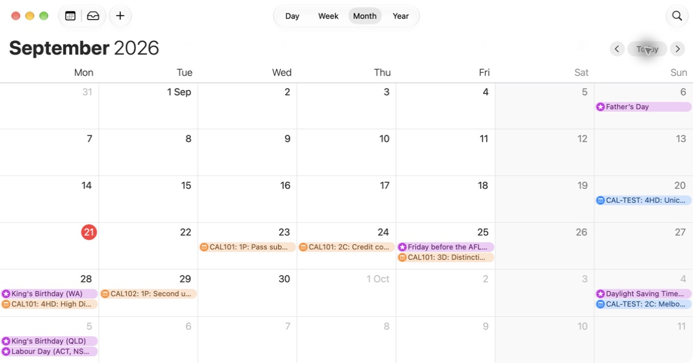
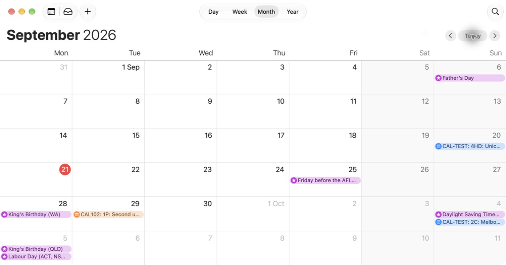

# CAL-D00: What the existing WebCal feed produces

This records the existing WebCal contract and the actual Apple Calendar subscription check completed on 21 September 2026. **CAL-D00 is complete:** the live feed rendered the five expected events, and manual refresh removed and restored an excluded unit's events.

## Feed shape

The feed is a single per-student iCalendar (`Webcal#to_ical`). The calendar declares a product id from the institution config. Merged API PR #147 corrected the refresh value to `PT4H` on both `X-PUBLISHED-TTL` and `REFRESH-INTERVAL`. This is a four-hour refresh hint; each calendar client decides when it actually refreshes.

## Which tasks appear

`Webcal#task_definitions` selects the task definitions for the student's enrolled, active projects, in active and currently-running units, and applies two filters:

- units the student has excluded are left out (via `WebcalUnitExclusion`),
- only task definitions at or below the student's target grade for that unit are included (`task_definitions.target_grade <= projects.target_grade`).

## Events per task

Each task definition produces one **end (due) event**, and also a **start event** if the student has enabled start dates.

- **Title:** `"{unit code}: {task abbreviation}: {task name}"`, for example `COS10001: 2.3P: Pass Task 2.3 - My Drawing Procedure`. With start dates enabled, titles are prefixed `Start:` and `End:`.
- **Date:** all-day, with `DTSTART` equal to `DTEND` in `YYYYMMDD` form and no time zone. The due-date chain uses the task's `effective_deadline_date` when a task record exists, then the target-grade-specific date for a flexible-date unit, then the task definition's `target_date`. Start events use the analogous `local_start_date`, target-grade-specific start date, and task definition `start_date` chain.
- **UID:** `E-{taskDefinitionId}` for the end event and `S-{taskDefinitionId}` for the start event. These are keyed on the task definition, so the same task shares a UID across students, which is what lets a client update the event in place on refresh.
- **Status:** `CONFIRMED`.
- **Reminder:** if the student has set a reminder, each event carries a display alarm that triggers the configured time before the event.
- **Custom properties:** `X-DOUBTFIRE-UNIT` (unit id) and `X-DOUBTFIRE-TASK` (task definition id).

Task events do not set a description, URL, or location, and the feed does not exclude submitted or completed tasks; every applicable task definition appears regardless of submission state.

## Optional learning sessions

The current API also includes published HelpHubs, lectures and classes when `include_learning_sessions` is enabled. These are timed UTC events with their real end times, stable occurrence UIDs, a sequence and last-modified timestamp, optional location and joining URL. Cancelled sessions carry `STATUS:CANCELLED` and omit joining links. Sessions are restricted to current active units in which the student remains enrolled, and use the same unit exclusions; grade filtering only applies to tasks.

The original source investigation used API `bb360dfa626f30e22c1382e20ef43c06ce6b38fa` and web `a35f2826ddff8a816175490c108f1794779c3254` on 20 September 2026. The live check below used the later revisions recorded in the environment notes. The server sets equal task DTSTART/DTEND, whereas the unit file exporter uses a next-day exclusive end. Apple Calendar rendered the server's five fixture events on their intended all-day dates; this result does not establish that representation's compatibility in other clients.

## Observed Apple Calendar subscription — 21 September 2026

The [isolated synthetic fixture](calendar/evidence-20260921/environment.md) ran on API `d7f7a5b9` and web `283b49336`, with development demo masking disabled for the two-unit UI. The real Web calendar switch enabled the account's feed. Both projects targeted High Distinction; start dates, reminders and learning sessions were off.

The first attempt paused at Apple Calendar's warning about the local HTTP connection and then at the locked Mac. After the Mac was unlocked, **Continue** was selected on that warning. Subscription and refresh checks then completed in **Apple Calendar 27.0 (3073)** on **macOS 27.0**, with the system timezone **Australia/Melbourne**.

A new subscription named **OnTrack CAL-D00 Local Test** was created with location **On My Mac**. Its automatic refresh setting was left at **Every week**. All refresh observations below followed an explicit **View → Refresh Calendars** command; no automatic refresh interval was tested or inferred from the feed's four-hour hint.

### Initial feed

Five subscribed events appeared as all-day events on these dates. Their complete titles and dates were checked in the native accessibility text; the month-view screenshot abbreviates titles to fit the cells.

| Event | Observed all-day date |
| --- | --- |
| CAL101: 1P: Pass submitted for feedback | 23 September 2026 |
| CAL101: 2C: Credit completed exercise | 24 September 2026 |
| CAL101: 3D: Distinction redo exercise | 25 September 2026 |
| CAL101: 4HD: High Distinction revision | 28 September 2026 |
| CAL102: 1P: Second unit pass task | 29 September 2026 |

The submitted and completed CAL101 tasks remained in the live feed, as the existing server contract specifies.

### Unit exclusion and restoration

| Action in OnTrack, followed by manual Calendar refresh | Observed result | First completed observation after refresh command |
| --- | --- | --- |
| Exclude CAL101 through the Web calendar dialog | Its four events disappeared; the CAL102 event on 29 September remained | 11 seconds |
| Add CAL101 back through the Web calendar dialog | All five events were present again on their original dates | 27 seconds |

These times are observation upper bounds, not measured refresh latencies: the client may have finished updating before the next completed inspection. The result establishes that the subscribed calendar reflected both changes after manual refresh.

Only synthetic test events and built-in public holidays are visible in these captures. No subscription URL or token is included. This completes CAL-D00's live-client observation requirement for Apple Calendar. It does not claim automatic-refresh timing, Google/Outlook subscription compatibility, or a test of optional reminders, start events or learning sessions. The separate file-import results and client-specific display observations are in [CAL-C01](CAL-C01-calendar-compatibility.md).

## Takeaway

Source inspection shows that the feed covers a student's current units, filtered by target grade and by any units they exclude, as all-day events with stable UIDs and optional reminders and start dates. Its limits are narrow and specific: it always uses the saved target grade rather than a chosen one, and it includes completed tasks. Those two points are the subject of CAL-D02.
