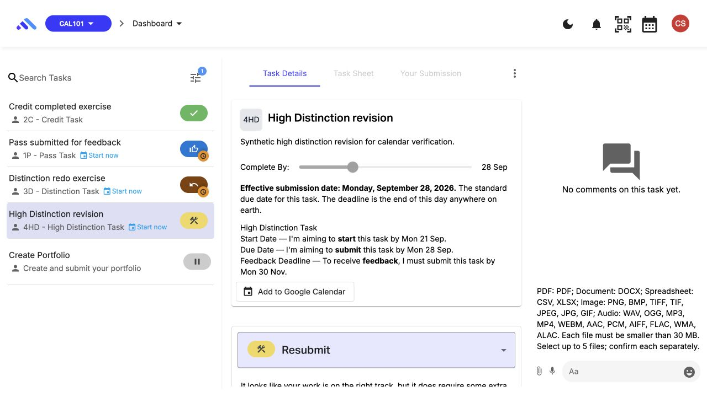
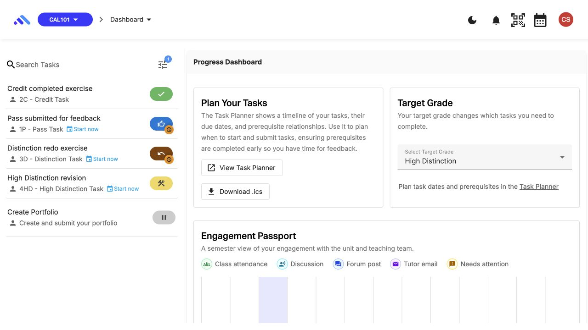
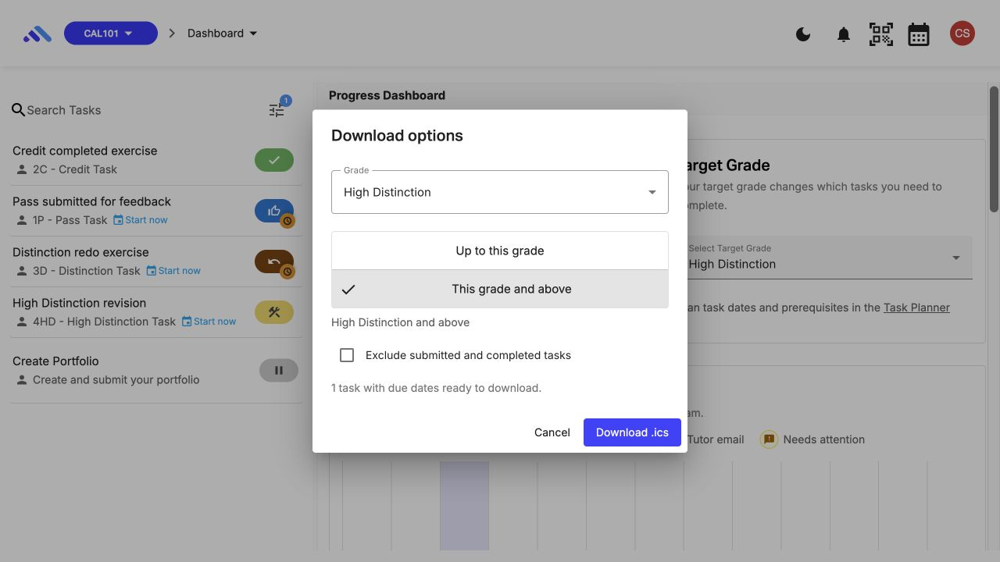

# CAL-UX01: Placement and styling of the calendar controls

The calendar controls appear in the running application as shown below. These screenshots were captured on 21 September 2026 using the [synthetic CAL101 fixture](calendar/evidence-20260921/environment.md), after implementation. They record the current placement; they are not historical before-and-after screenshots.

## Task action

**Add to Google Calendar (CAL-F01)** appears in the task description card's action row. Its outlined button and calendar icon use the same Material conventions as the task's other resource actions. Resource buttons depend on the files available for that task; this synthetic task shows the calendar action by itself.

## Unit download and global calendar

**Download .ics (CAL-F02)** sits below **View Task Planner** in the Progress Dashboard's **Plan Your Tasks** card. The global calendar icon is in the top header beside the QR icon. Its placement lets a student reach the subscription settings without opening a particular task.

## Download options

The download button opens a standard Material dialog. **Grade** appears first, followed by vertically stacked grade-range choices, the submitted/completed-task checkbox, the result count, and the action buttons. The screenshot records **High Distinction + This grade and above**, which selects exactly the one HD task in this fixture.

The actual [grade and submitted-task exports](calendar/evidence-20260921/exports/README.md) confirm the selections shown by these controls. The original [placement illustration](calendar/calendar-controls.svg) remains available as design documentation; the screenshots above provide the application evidence.

**Download a copy (CAL-F08)** belongs to the Web calendar dialog alongside its subscription URL controls. That is the live-feed copy action; the unit download and its local grade/status filters remain in the Progress Dashboard.

Opening Download options focuses Grade; the result count is a status message. See [CAL-A01](CAL-A01-accessibility-verification.md) for keyboard and assistive-technology verification. These desktop screenshots establish placement and styling; they do not establish a separate mobile or screen-reader test result.
