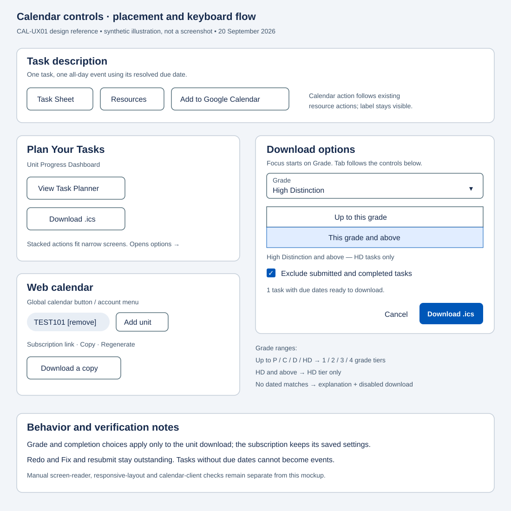

# CAL-UX01: Placement and styling of the calendar controls

This note records where each calendar control was placed and why. The controls were built to match the app's existing Material markup and icon conventions so they read as native rather than bolted on, which is what this ticket set out to ensure.

- **Add to Google Calendar (CAL-F01):** in the task description card's action row, as a `mat-stroked-button` with a `mat-icon` sized to match the existing Task Sheet and Resources buttons already in that row.
- **Download .ics and its options (CAL-F02, F06, F07, F09):** the button is in the Progress Dashboard's "Plan Your Tasks" card, below the existing "View Task Planner" button. Its options open in a standard `mat-dialog`: the grade selector mirrors the Task Planner's Target Grade `mat-select`, the grade range is a `mat-button-toggle-group` stacked vertically so it fits a phone, and the submitted/completed exclusion control is a standard `mat-checkbox`, so the card and the dialog keep one visual language.
- **Header calendar button (CAL-F04):** a `mat-icon-button` beside the QR icon in the header, with a tooltip. It is intentionally unguarded, since WebCal is a global feed rather than a unit-scoped action.
- **Download a copy (CAL-F08):** in the Web calendar modal, next to the subscription URL controls, so subscribe and download sit together.

## Reviewable placement mockup

The committed SVG is a synthetic placement mockup, not a screenshot of a running application. It shows the action order, phone-friendly stacked controls, the HD-only selection and the separate subscription flow. Real application screenshots remain useful for manual visual verification.

Opening download options focuses Grade; result counts announce filter changes. Unit exclusion and Add unit use named native buttons. See [CAL-A01](CAL-A01-accessibility-verification.md) for the checks and remaining manual evidence.
