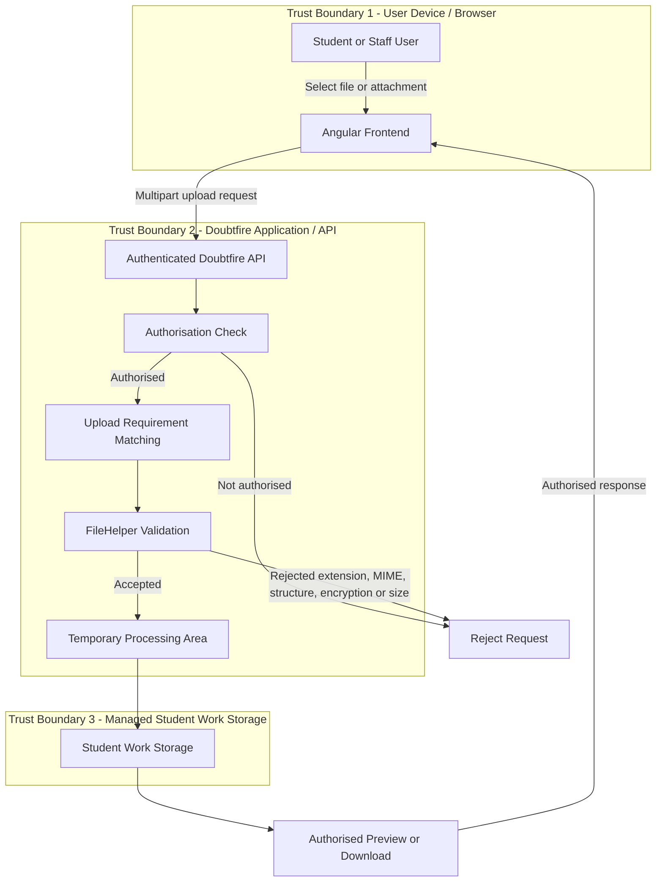

# FILE-A01 Current vs Approved Format and Limit Matrix

## Policy Principles

- Task submissions and task-chat attachments have separate policies because they serve different purposes.
- The API is the final authority for all upload decisions.
- The frontend may guide file selection but must not override API rejection.
- Uploads use explicit allowlists. Arbitrary file extensions are not permitted.
- New specialist formats require a demonstrated unit need and policy review.

## Format Matrix

| Category | Current State | Proposed Approved Formats | Context | Classification | Preview Policy |
|---|---|---|---|---|---|
| Spreadsheet | Internal `csv` category supports CSV, XLS and XLSX | `.csv`, `.xls`, `.xlsx` | Task submission | MVP | Download-only unless a dedicated safe spreadsheet viewer is added |
| PDF | API validates PDF structure. Task chat accepts PDF. Existing frontend `document` category includes PDF | `.pdf` | Task submission and task chat | MVP | Submission: PDF viewer. Chat confirmation: filename and PDF indicator |
| Document | API has dedicated DOCX structural validation through `word_document` and comment attachment handling | `.docx` | Task submission where explicitly required | MVP | Download-only |
| Code | Existing curated Code category contains common development and text formats | Existing reviewed Code allowlist only | Task submission | MVP | Safe text/code preview through Monaco where supported |
| Image | Existing image category supports common raster image formats | `.png`, `.bmp`, `.tiff`, `.tif`, `.jpeg`, `.jpg`, `.gif` | Task submission and task chat | MVP | Inline image preview |
| Audio | Task chat currently accepts audio and API validates audio MIME types | Browser-compatible API-approved audio formats | Task chat | MVP | Inline audio player |
| Archive | API supports ZIP, TAR, TAR.GZ and TGZ with additional archive validation | `.zip`, `.tar`, `.tar.gz`, `.tgz` | Task submission only when explicitly required | Controlled MVP | Download-only |
| Video | Limited backend support exists but ordinary task chat does not expose video upload | No general MVP approval | Specialist / future | Future | Download-only unless a dedicated safe viewer is approved |
| Macro-enabled Office | Not part of the approved upload path | None | All contexts | Excluded | None |
| Encrypted files | Encrypted PDF, ZIP and Word packages are rejected | None | All contexts | Excluded | None |
| Executables / installers | Not present in the approved extension allowlist | None | All contexts | Excluded | None |
| Disk images | Not present in the approved extension allowlist | None | All contexts | Excluded | None |
| Nested archives | Explicitly rejected by archive validation | None | All contexts | Excluded | None |
| Unknown / arbitrary formats | Explicit allowlists are already used | None | All contexts | Excluded | None |

## Display Names

The approved user-facing category names are:

- Spreadsheet
- PDF
- Document
- Code
- Image
- Audio
- Archive

Internal identifiers do not need to match the user-facing labels. Existing identifiers should remain stable where required for backward compatibility.

In particular:

- Internal `csv` remains supported while displaying as `Spreadsheet`.
- Legacy `archive` requirements continue to map to the approved archive / `zip` policy.
- Existing task definitions must not require migration simply to improve display terminology.

## Task Submission Limits

Current behaviour:

- The number of submitted files must exactly match the task definition's configured `upload_requirements`.
- Each file is validated independently by the API.
- File size is controlled by `Doubtfire::Application.config.max_file_size`.
- The existing fallback when no valid configured value is present is 10 MB per file.

Proposed policy:

- Preserve the configured per-file limit model.
- Retain 10 MB as the safe fallback.
- Require exactly one uploaded file for each configured upload requirement.
- Extra or missing files are rejected.
- Archive uploads remain subject to additional expanded-size, entry-count and compression-ratio limits.

## Task Chat Limits

Current behaviour:

- The frontend permits multiple file selection.
- Each accepted file is confirmed and posted separately.
- The API enforces a 30 MB maximum per attachment.
- No explicit frontend attachment-count cap was found.

Proposed policy:

- Retain 30 MB as the maximum per task-chat attachment.
- Introduce a maximum of 5 attachments per user selection as an implementation safeguard, subject to reviewer approval.
- Each selected attachment continues to become its own task comment and receives independent API validation.
- The count limit is a usability and abuse-control measure and does not replace server-side file validation.

## High-Risk Format Decisions

### Macro-enabled documents

Reject macro-enabled formats such as DOCM and XLSM. They are not part of the current approved extension path and introduce executable macro content that is unnecessary for the common MVP use cases.

### Encrypted files

Reject encrypted PDFs, Office packages and archives. The API cannot inspect encrypted contents reliably, so accepting them would bypass content validation.

### Archives

Archives are permitted only for task submissions that explicitly require them. Supported formats are ZIP, TAR, TAR.GZ and TGZ. Nested archives, encrypted entries, unsafe paths and symbolic links remain prohibited.

### Executables and installers

Reject executable and installer formats including EXE, MSI and similar binary packages. They are outside the educational upload MVP and create unnecessary execution risk.

### Disk images

Reject ISO, DMG and similar disk-image formats. They are not required for the common task-submission or task-chat use cases.

### Unknown formats

Do not provide an arbitrary extension override. New formats must be added through an approved policy change backed by a real teaching or assessment requirement.

## Preview Policy

### Inline or specialised preview

- Image: inline image rendering.
- Audio: controlled audio player in task chat.
- PDF: dedicated PDF viewer for submitted files.
- Code and text: Monaco-based text/code preview where supported.

### Metadata-only confirmation

- PDF in the current task-chat upload confirmation dialog is represented by filename and PDF indicator rather than rendering its contents.

### Download-only

- Spreadsheet files.
- DOCX documents.
- Archives.
- Specialist approved formats without an explicitly approved renderer.

A format must not be rendered generically merely because a browser may support it. Preview requires an intentional application-controlled rendering path.

## Acceptance Rule

Passing frontend filtering does not mean a file is accepted.

Every upload must still pass API-side checks for the applicable category, including extension, MIME type, structure, encryption status, archive safety, size and authorisation before it is stored.

# FILE-A01 Frontend and API Upload Policy Contract

## 1. Authority

The Doubtfire API is the final authority for every upload decision.

Frontend checks exist to improve usability by showing appropriate file categories, picker filters, limits and validation messages. A file passing a frontend check does not mean that it is accepted.

The API must independently validate every uploaded file before permanent storage.

Server-side validation must include, where applicable:

- authorisation
- upload context
- configured upload requirement
- approved category
- file extension
- MIME type
- structural validation
- encryption status
- archive safety
- file size
- attachment count or requirement count

A frontend decision must never override an API rejection.

## 2. Policy Source

The frontend must not maintain an independently evolving security allowlist.

The approved policy should be owned by the API or by a single versioned policy definition consumed by the API.

A later implementation ticket should expose the frontend-safe portion of that policy through an API policy response or equivalent generated contract.

The frontend may use that contract to populate:

- category display names
- accepted file-picker extensions
- upload-context availability
- maximum file size
- maximum attachment count
- preview capability
- user-facing guidance

The frontend must treat this information as guidance only. Server-side validation remains mandatory.

## 3. Proposed Frontend-Safe Policy Shape

A future policy response should expose only information required by the client, for example:

```json
{
  "version": "1",
  "contexts": {
    "task_submission": {
      "categories": ["spreadsheet", "pdf", "document", "code", "image", "archive"],
      "default_max_file_size": 10000000
    },
    "task_chat": {
      "categories": ["pdf", "image", "audio"],
      "max_file_size": 30000000,
      "max_selection_count": 5
    }
  }
}
```

Category information may include:

- stable internal identifier
- display name
- approved extensions
- context availability
- preview mode

Security implementation details do not need to be exposed to the browser.

## 4. Stable Internal Identifiers

Existing task definitions must remain compatible.

Current identifiers should be preserved where changing them would require migration.

Examples:

- Internal `csv` continues to represent the spreadsheet upload category.
- The user-facing label for `csv` is `Spreadsheet`.
- Existing `archive` requirements continue to resolve to the approved `zip` / archive policy.
- Existing `document`, `code`, `image` and `zip` requirements continue to work.

Display terminology may improve without rewriting stored task definitions.

## 5. Filename Rules

User-provided filenames are untrusted input.

The API must:

- remove directory components before using a supplied filename
- reject or replace unsafe path characters
- remove control characters and header-injection material
- normalise invalid UTF-8 safely
- use a safe fallback name when the supplied name is blank or unsafe
- limit human-readable display names to 255 characters
- avoid using the original filename as a server storage path

Server-managed or ID-based storage names should be used wherever possible.

The original safe display name may be retained for user-facing download metadata where appropriate.

## 6. Display-Name Rules

The interface should use clear user-facing names:

- Spreadsheet
- PDF
- Document
- Code
- Image
- Audio
- Archive

Display names are presentation metadata and must not determine whether the API accepts a file.

## 7. Error Contract

Upload rejection should use consistent machine-readable error codes together with safe user-facing messages.

Proposed error codes:

- `UPLOAD_UNAUTHORISED`
- `UPLOAD_EMPTY`
- `UPLOAD_TOO_LARGE`
- `UPLOAD_COUNT_MISMATCH`
- `UPLOAD_EXTENSION_NOT_ALLOWED`
- `UPLOAD_MIME_INVALID`
- `UPLOAD_CORRUPT`
- `UPLOAD_ENCRYPTED`
- `UPLOAD_ARCHIVE_UNSAFE`
- `UPLOAD_ARCHIVE_LIMIT`
- `UPLOAD_CATEGORY_NOT_ALLOWED`
- `UPLOAD_UNKNOWN_POLICY`

User-facing messages should explain the corrective action without exposing sensitive server implementation details.

Example:

`UPLOAD_TOO_LARGE` -> `The selected file exceeds the permitted upload size.`

## 8. Logging Rules

Server logs should record enough information to diagnose rejected uploads without recording file contents.

Appropriate logging includes:

- validation stage
- rejection reason/error code
- upload context
- category requested
- authenticated user identifier where operationally required
- task/project identifiers where required
- processing failures
- cleanup failures

Logs must not include:

- uploaded file contents
- authentication tokens
- unnecessary sensitive user information

Expected validation failures should normally use appropriate debug or structured operational logging. Unexpected processing failures should be logged as errors.

## 9. Temporary File and Cleanup Rules

Rejected uploads must not be moved into permanent student-work storage.

Temporary files created during validation, compression or conversion must be removed when processing completes or fails.

Processing should:

1. receive the upload in temporary storage
2. perform authorisation and policy checks
3. validate the file
4. perform required safe processing
5. move only accepted output into managed storage
6. remove temporary artefacts

Existing cleanup behaviour using `FileUtils.rm_f`, `FileUtils.rm_rf`, Tempfile cleanup and server-managed working directories should be preserved.

## 10. Backward Compatibility

The approved policy applies to new upload decisions.

Existing task definitions must continue to function using their stored upload requirement identifiers.

Previously accepted attachments must not be retrospectively deleted or made inaccessible solely because the approved policy changes.

Compatibility rules:

- preserve existing internal identifiers where possible
- preserve `csv` as the spreadsheet-category identifier
- continue mapping legacy `archive` requirements to the archive policy
- preserve authorised access to existing stored attachments
- apply current validation policy when a user uploads or replaces a file
- do not require migration solely to change a display label
- document any future category removal before enforcement

If an older attachment uses a format no longer approved for new uploads, authorised users may retain download access unless a separate security decision requires quarantine or removal.

## 11. Implementation Ownership

Later frontend tickets should implement:

- policy-driven picker filters
- category labels
- client-side size/count guidance
- preview behaviour
- accessible validation messaging

Later backend tickets should implement:

- authoritative policy representation
- policy response/contract
- server-side category enforcement
- consistent error codes
- size/count enforcement
- security validation

Later deployment and test tickets should verify:

- configured limits
- policy availability
- rejection behaviour
- storage isolation
- cleanup behaviour

FILE-A01 defines the policy. It does not make these production changes.


# FILE-A01 Code Category Review

## Repository Evidence

The API repository confirms that `code` is an established task-upload requirement.

Evidence includes:

- API comment tests using a `code` upload requirement
- unit API tests using Code-file requirements
- unit factory data using an Imported Code requirement
- submission-history tests using `main.rb`
- task-definition tests using `main.rb`
- similarity cleanup tests using a Code source requirement

The strongest concrete extension-level evidence found in the repository is Ruby through repeated `main.rb` examples.

The repository does not provide enough real unit-definition data to demonstrate that every extension in the current Code allowlist is actively required by teaching units.

## FILE-A01 Decision

For the MVP:

- preserve the existing curated Code allowlist for backward compatibility
- do not introduce arbitrary extensions
- do not expand the Code allowlist solely because a file is text-based
- require a documented teaching or assessment use case before adding new extensions
- treat removal of existing extensions as a compatibility-sensitive change requiring separate review
- continue to require API-side extension and MIME validation

FILE-A01 therefore does not claim that every existing Code extension has been independently justified by current unit evidence.

The policy establishes a maintainable rule: preserve current compatibility now, then make future additions or removals through reviewed evidence rather than uncontrolled allowlist growth.


# FILE-A01 Data Flow and Trust Boundaries



## Submission Upload Flow

1. The user selects the files required by the task definition.
2. Angular sends the files to `/projects/{projectId}/task_def_id/{taskDefinitionId}/submission`.
3. The API checks `authorise?(current_user, project, :make_submission)`.
4. `scope_files(...)` ensures the submitted files match the configured upload requirements.
5. `task.accept_submission(...)` processes the submission.
6. Each file is checked by `FileHelper.accept_file(...)`.
7. Extension, MIME type, structure, encryption, archive safety and size rules are enforced server-side.
8. Accepted files pass through temporary processing before being placed in managed student-work storage.
9. Stored files are exposed only through authorised preview or download paths.

## Task Chat Attachment Flow

1. The user selects image, audio or PDF attachments in the task-comment composer.
2. The frontend filters supported selections and provides appropriate confirmation or preview behaviour.
3. The attachment is sent through the task-comment API.
4. The API enforces the 30 MB per-file attachment limit.
5. `FileHelper.accept_file(..., 'comment_attachment')` makes the final format decision.
6. Accepted attachments are stored in server-managed, ID-based paths.
7. Authorised users can later retrieve the attachment.

## Trust Decisions

- Frontend validation is advisory and exists for usability.
- The API is the final authority for every upload decision.
- User-provided filenames are not trusted as storage paths.
- Uploaded content is not trusted based on file extension alone.
- MIME and structural validation occur inside the trusted API boundary.
- Managed student-work storage is separated from the browser boundary.
- Rejected files must not proceed into managed student-work storage.
- Existing authorisation rules continue to control upload and retrieval access.


# FILE-A01 Security and Test Acceptance Requirements

## Security Acceptance Requirements

The implementation that follows FILE-A01 must satisfy all of the following requirements.

### Authorisation

- Every upload endpoint must require the existing authenticated user context.
- Task submissions must continue to enforce the existing `:make_submission` authorisation rule.
- Attachment retrieval must remain subject to the existing project and task access controls.
- Client-side validation must never substitute for server-side authorisation.

### File-Type Validation

- Every new upload must be checked against an explicit approved category.
- Extension checks and MIME checks must both be applied where supported.
- A valid extension alone is not sufficient for acceptance.
- Unknown or arbitrary file categories must be rejected.
- Macro-enabled Office formats must remain excluded unless separately approved.
- Executables, installers and disk-image formats must be rejected.

### Document Validation

- PDF files must be structurally readable before acceptance.
- Corrupt PDFs must be rejected.
- Encrypted PDFs must be rejected.
- DOCX files must be validated as genuine OOXML packages.
- Required DOCX package entries must be present.
- Encrypted DOCX content, unsafe paths and link entries must be rejected.

### Archive Validation

Approved archive uploads must:

- use an explicitly supported archive format
- contain at least one file
- reject unsafe internal paths
- reject nested archives
- reject encrypted entries
- reject symbolic links
- enforce an entry-count limit
- enforce a total uncompressed-size limit
- enforce a compression-ratio limit

The existing default protections of 1,000 entries, 10 times the configured upload size for total uncompressed content, and 100:1 compression ratio should be preserved unless separately reviewed.

### Size and Count Limits

Task submissions:

- must contain exactly the files required by `upload_requirements`
- must reject missing or additional files
- must enforce the configured per-file maximum
- must retain 10 MB as the fallback when no valid configured maximum exists

Task chat:

- must enforce 30 MB per attachment
- should enforce the approved attachment-selection count once finalised
- must validate every selected attachment independently

### Filename and Storage Safety

- Original filenames must not be used as trusted storage paths.
- Directory components must be removed.
- Control characters and unsafe filename characters must be removed or replaced.
- Invalid UTF-8 must be handled safely.
- Display names must be limited to 255 characters.
- Server-managed or ID-based storage paths should be used.
- Rejected uploads must not reach permanent student-work storage.

### Logging and Cleanup

- Validation failures must produce a useful server-side reason.
- Unexpected processing failures must be logged as errors.
- Logs must not contain uploaded file contents or authentication secrets.
- Temporary files must be removed after successful processing or failure.
- Partial processing artefacts must not remain indefinitely.

## Functional Test Acceptance Requirements

### Task Submission Tests

Verify that:

1. CSV is accepted when a Spreadsheet requirement permits it.
2. XLS and XLSX are accepted under the Spreadsheet category.
3. The existing internal `csv` requirement still displays as Spreadsheet.
4. Approved Code formats remain accepted.
5. Unsupported Code extensions are rejected.
6. Valid PDF submissions are accepted.
7. Corrupt PDFs are rejected.
8. Encrypted PDFs are rejected.
9. Valid images are accepted where Image is required.
10. Valid approved archives are accepted where Archive is required.
11. Nested archives are rejected.
12. Encrypted archives are rejected.
13. Archives containing unsafe paths are rejected.
14. Files above the configured size limit are rejected.
15. Missing or extra files produce an upload-requirements mismatch.
16. Legacy `archive` requirements continue to resolve to the archive policy.

### Task Chat Tests

Verify that:

1. Approved images can be selected and uploaded.
2. Approved audio can be selected and uploaded.
3. PDF attachments can be selected and uploaded.
4. Unsupported file types are rejected.
5. Attachments above 30 MB are rejected by the API.
6. Multiple selected attachments are processed individually.
7. Each attachment receives independent API validation.
8. Image confirmation displays an image preview.
9. Audio confirmation provides an audio player.
10. PDF confirmation displays filename/type metadata without unsafe generic rendering.

### Security Regression Tests

Verify rejection of:

- `.exe`
- `.msi`
- `.iso`
- `.dmg`
- `.docm`
- `.xlsm`
- encrypted PDF
- encrypted DOCX
- encrypted archive
- nested archive
- archive path traversal
- archive symbolic link
- corrupted PDF
- invalid DOCX package
- mismatched MIME and extension where detectable

### Preview Tests

Verify that:

- code/text preview uses the controlled Monaco path
- submitted PDFs use the dedicated PDF viewer
- images use controlled image rendering
- task-chat audio uses the audio player
- formats without an approved renderer display a no-preview state
- download-only formats are never passed into an arbitrary generic renderer

### Backward-Compatibility Tests

Verify that:

- existing task definitions using `csv` continue to function
- `csv` displays as Spreadsheet
- existing `archive` aliases continue to resolve correctly
- existing stored attachments remain retrievable by authorised users
- changing display labels does not require rewriting task definitions
- new policy enforcement applies to new uploads without silently deleting historical attachments

## Contract Tests

The later implementation should include tests confirming that:

- frontend policy data matches the authoritative API contract
- frontend picker restrictions are derived from the approved policy
- the frontend cannot override API rejection
- policy changes can be versioned without breaking existing clients
- missing or invalid policy data fails safely

## Completion Standard

A later implementation ticket is not complete until:

- approved formats succeed in their intended contexts
- excluded formats fail predictably
- size and count limits are enforced
- security checks cannot be bypassed from the frontend
- existing task definitions remain compatible
- temporary processing is cleaned up correctly
- required automated tests pass


# FILE-A01 Stakeholder and User-Request Mapping

## Purpose

This mapping connects the proposed upload policy to the people who use, implement, secure and maintain the feature.

## Student Needs

### Task submissions

Students need to upload the common file formats required by assessment tasks without having to understand internal Doubtfire file-category names.

Required common use cases:

- submit PDF reports
- submit CSV and Excel spreadsheets
- submit source-code files for programming tasks
- submit images where evidence or visual work is required
- submit approved archives where a task explicitly requires multiple related files
- submit DOCX documents where the task explicitly requires a Word document

Policy response:

- use clear display names such as Spreadsheet, PDF, Document, Code, Image and Archive
- preserve existing task-definition compatibility
- reject files with a clear reason when they do not meet the approved policy

### Task chat

Students need to provide supporting evidence or communicate with teaching staff using lightweight attachments.

Required common use cases:

- attach screenshots or other approved images
- attach PDF evidence
- attach or record audio

Policy response:

- task chat has a smaller approved format set than task submissions
- task-chat attachments remain independently validated by the API
- images and audio use controlled previews
- PDF attachments use safe metadata/controlled viewing behaviour

## Teaching Staff Needs

Teaching staff need:

- predictable file categories when configuring task requirements
- confidence that student uploads match the task definition
- continued access to previously accepted submissions and attachments
- clear filenames and download behaviour
- safe preview paths for common formats
- actionable error information when uploads are rejected

Policy response:

- internal identifiers remain stable for compatibility
- the API remains authoritative
- existing task definitions continue to work
- historical attachments are not invalidated solely because policy changes

## Frontend Team Needs

The frontend team needs:

- one approved set of display names
- approved extensions for picker guidance
- context-specific size/count information
- preview capability information
- predictable error codes from the API

Policy response:

- frontend policy data should come from an API-owned or single versioned contract
- the frontend must not maintain an independently evolving security allowlist
- frontend filtering remains advisory

## Backend Team Needs

The backend team needs:

- authoritative category definitions
- explicit extension and MIME rules
- clear size and count limits
- consistent rejection behaviour
- backward-compatibility requirements
- storage and cleanup requirements

Policy response:

- API owns final acceptance decisions
- all uploads pass server-side validation
- consistent machine-readable errors should be introduced by later implementation tickets

## Security Review Needs

Security reviewers need explicit decisions for:

- encrypted files
- macro-enabled documents
- executable files
- installers
- disk images
- archives and nested archives
- filename/path safety
- decompression limits
- temporary-file cleanup
- preview behaviour

Policy response:

- encrypted, macro-enabled, executable, installer, disk-image and arbitrary formats are excluded from the common MVP
- approved archives receive additional structural controls
- generic browser rendering is not treated as an approved preview mechanism

## Documentation Team Needs

Documentation needs:

- stable user-facing category names
- clear accepted-format guidance
- clear size limits
- clear rejection guidance
- distinction between task submission and task-chat policies

Policy response:

Approved user-facing names are:

- Spreadsheet
- PDF
- Document
- Code
- Image
- Audio
- Archive

Documentation should describe user-facing categories rather than exposing legacy internal identifiers unless needed for technical documentation.

## Objective Lead Needs

The Objective 4 lead needs confirmation that:

- the policy is implementable by later frontend/backend tickets
- production code is not changed by FILE-A01
- cross-objective ownership remains respected
- MISC-X01 governs branch/shared-ownership decisions
- SLR-R01 remains separate from this upload-policy work
- unresolved decisions are clearly identified before implementation begins

## Review Mapping

The final FILE-A01 review should obtain acknowledgement from:

| Reviewer | Review Focus |
|---|---|
| Frontend | picker policy, display names, previews, client contract |
| Backend | authoritative validation, limits, storage and API contract |
| Security | exclusions, archive safety, filename handling, cleanup |
| Documentation | terminology and user guidance |
| Objective lead | scope, ownership, approval and implementation readiness |

## Outstanding Review Decisions

The following items require reviewer agreement before the policy is considered final:

1. Whether 5 attachments per task-chat selection is the approved count limit.
2. Whether DOCX should be part of the common task-submission MVP or remain available only where explicitly required.
3. Whether the current Code extension list should be reduced before implementation or preserved initially and reviewed separately.
4. Whether an API policy endpoint or generated shared policy contract is preferred.
5. Location of the documentation-team notes referenced by the FILE-A01 card.
6. Final branch/repository location under the MISC-X01 shared-ownership process.

