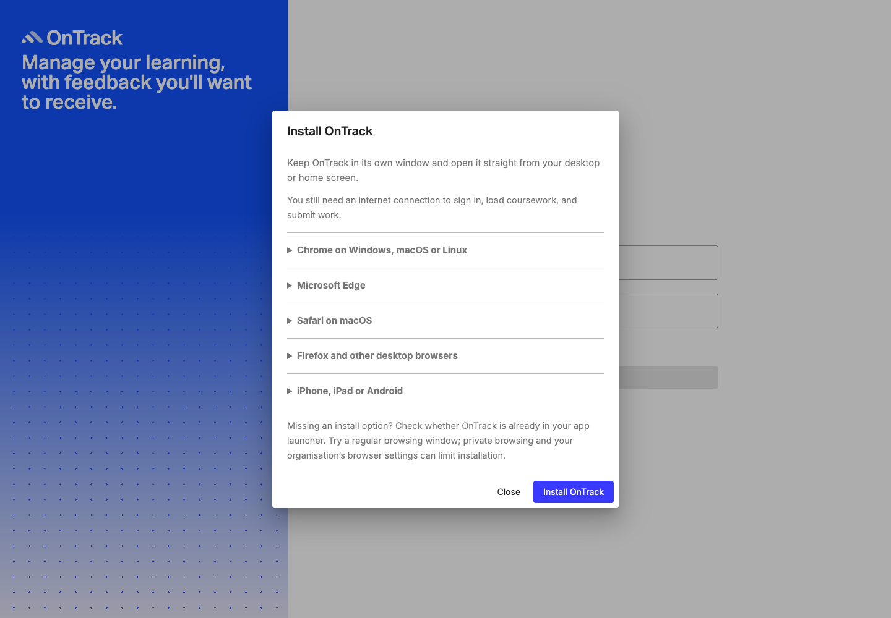
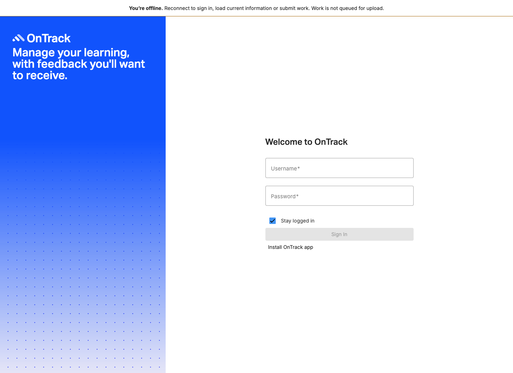
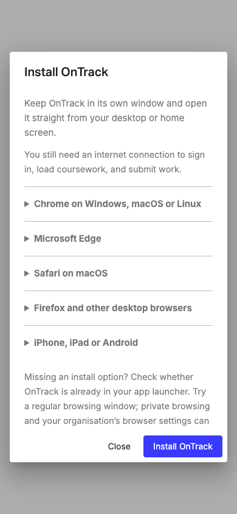

# Desktop PWA validation — 21 September 2026

Implementation base: web `283b49336` on `11.0.x`; companion deploy base `2e513e1`.
Test environment: macOS, Node 22.23.2, Angular 22.0.3, Chrome 153.0.8010.48.

## Automated checks

- 60 focused Angular tests passed across installation service/dialog/button,
  offline status, header, sign-in and update service (seven spec files).
- Production Angular build and application type checking passed. The build emits
  existing large component-style, CommonJS and dependency/minification warnings;
  this feature does not resolve those unrelated warnings.
- Targeted ESLint, Prettier and `git diff --check` passed.
- `npm run verify:deployment-config`, `npm run verify:pwa` and
  `npm run verify:pwa:build` passed against the final production output.
- Companion deploy verifier: 15 HTTP regression tests passed; the CLI passed
  against these production assets served on loopback.

## Real Chromium smoke test with synthetic API responses

A disposable persistent Chrome profile loaded the actual production output from
an isolated loopback HTTP server. Only public branding/auth-method responses were
stubbed; authentication returned a signed-out result. No real account or live
institutional server was used. No OS app was installed into the user's profile.

Passed:

1. Sign-in install entry, browser help dialog, Escape and return of focus.
2. Chrome's manifest parser and installability checks returned no errors; the
   real Angular service worker controlled the page.
3. Public-asset verifier accepted the served production output.
4. Offline status appeared; after all prefetch assets finished caching, a reload
   came from the service worker and rendered the offline app shell.
5. Reconnect cleared the warning without forcing navigation.
6. `/api/d2l/callback` navigation returned network JSON instead of app HTML.
7. Installation help remained within a 390px viewport, retaining mobile guidance.
8. No uncaught page errors occurred.

The cold offline shell displays the existing unavailable state because sign-in
and public settings need the API; this is expected, not offline authentication.
The test waits for all prefetch cache entries and `Driver state: NORMAL`; a
controller alone is insufficient. Chrome's network simulation uses both request
blocking and `Network.overrideNetworkState` so `navigator.onLine` remains false
across document reloads. The earlier controller-only and incomplete emulation
attempts were corrected in the test harness, without changing production code.

[Machine-readable browser result](evidence/desktop-pwa-20260921/browser-results.json)

## Not yet exercised

OS installation/relaunch/uninstall on Windows, macOS and Linux; actual Safari,
Edge and Firefox implementations; institutional SSO; authenticated student/staff
workflows; live Web Push; two-release update/rollback; and real Android/iOS
installation regression. Complete the [staging acceptance checklist](desktop-pwa.md#required-staging-acceptance)
before production rollout. Headless browser and unit-test results are not a
claim that those combinations passed.
