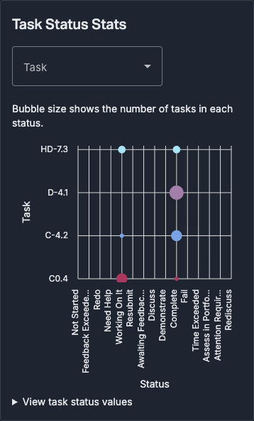
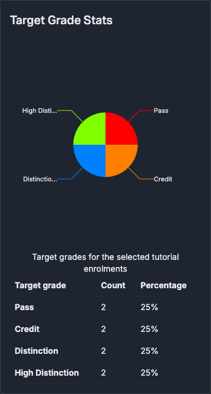
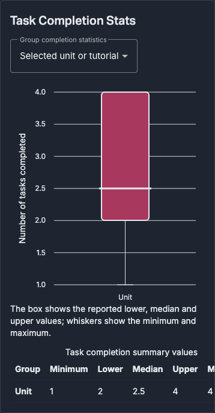
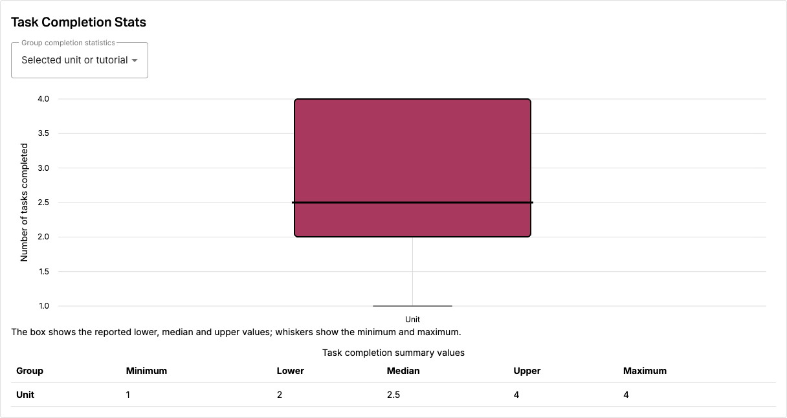

# Authenticated Unit Statistics acceptance — 21 September 2026

The MG-11 charts were exercised through the full application as a synthetic convenor,
using actual authenticated API responses from a disposable database. All three SVGs,
their values tables, tutorial/task filters, grade grouping and failed-request recovery
passed. The walkthrough also found a dark-theme SVG label contrast defect; the
focused correction and its verification are described below.

## Runtime and provenance

- Browser: Google Chrome `153.0.8010.48`, automated with Playwright, in an isolated profile.
- Web: existing full production artifact `a9e7af46f`, whose analytics source is
  `66e3e20565ab1c61e0158f9fcf3a8d896dcdb11c`, served on localhost:4320.
  The three chart components, shared chart styles and Unit Statistics route were
  compared with merged web `283b493367681d1abab23e5fe7c633ba3a57e5c2`; they are identical.
  This was not a newly built Angular artifact.
- API: merged `11.0.x` at `d7f7a5b9c2d34ef279ac3a70bc58823def64005c`, running on
  localhost:3011 with its own disposable database and Redis. Eight synthetic enrolled
  learners, two tutorials and four tasks give non-zero, varied completion summaries.
- Authentication, authorization, models and statistics endpoints ran normally. Local
  fixture support supplied synthetic Turnitin feature metadata, blocked outbound HTTP,
  used test mail with delivery disabled and faked Sidekiq. No external provider
  integration, production account or independent human acceptance is claimed.
- Passwords and auth tokens are absent from this evidence. The seed generates fresh
  passwords in a private local file, which must not be committed.

## Functional results

[Raw functional results](acceptance-2026-09-21/functional-results.json) and
[actual API payloads](acceptance-2026-09-21/api-payloads.json) record the run at
05:03 UTC. The API returned 200 from all three statistics endpoints.

| Check                     | Observed result                                                                                                                                                                                           |
| ------------------------- | --------------------------------------------------------------------------------------------------------------------------------------------------------------------------------------------------------- |
| Whole unit                | Three rendered SVGs; grade counts 2/2/2/2; 32 task-status observations; completion values min 1, lower 2, median 2.5, upper 4, max 4.                                                                     |
| First tutorial            | Grade counts 2/2; status total and all five completion values matched that tutorial's actual API subgroup.                                                                                                |
| One task in that tutorial | One task represented, with four tutorial enrolments; other charts retained the tutorial selection.                                                                                                        |
| Grade grouping            | Every grade's five summary values matched the API's whole-unit grade grouping.                                                                                                                            |
| Partial failure and retry | A browser-only intercepted 503 hid the affected task-status chart. Successful charts remained available. Removing the interception and choosing Retry restored the actual API data and cleared the alert. |
| Browser errors            | No uncaught page errors.                                                                                                                                                                                  |

The synthetic data exercises the existing API population and summary calculation.
It does not redefine enrolment totals as deduplicated student headcounts. Numeric
labels and the supplied lower/median/upper values are preserved; the component tests
also check the actual ngx-charts box properties, as recorded in [validation](validation.md).

## Theme defect and focused correction

SVG text defaults to black independently of inherited CSS `color`. Before the fix,
all three charts had black labels on the dark card, measured at **1.37:1** contrast.
The shared component `.chart` rule now sets `fill: currentColor`; chart marks with
explicit fill attributes retain their existing colours. The rule remains within the
three components' shared stylesheet.

The source correction is [PR #274](https://github.com/ontrack-features-t2-2026/doubtfire-web/pull/274), commit
[`21b068968177836043c862fc0439d7c359e1d6b2`](https://github.com/ontrack-features-t2-2026/doubtfire-web/commit/21b068968177836043c862fc0439d7c359e1d6b2).
Its regression script tests the served application by default. For this constrained
local run, `ANALYTICS_STYLE_OVERLAY=1` compiled that checkout's actual SCSS with Sass
and applied the resulting CSS under the three component host selectors to the existing
artifact. **These screenshots and contrast results demonstrate a compiled source SCSS
overlay, not a rebuild of the Angular application with the fix.** Normal CI builds and
the script's default served-build mode provide the separate integration check.

[Raw theme measurements](acceptance-2026-09-21/theme-results.json) include baseline
fills, every rendered label, explicit mark fills and chart widths. Each phase asserted
the root `data-ot-theme` value, waited for the ngx-charts initial drawing/fade to settle,
then measured the actual SVG. The first fast functional-run screenshots were captured
before that settling delay; they are not used as visual acceptance evidence here.

| Theme | Viewport | Label contrast, all three charts | Chart and SVG widths | Explicit mark colours   |
| ----- | -------- | -------------------------------- | -------------------- | ----------------------- |
| Dark  | 1440px   | 12.54:1                          | 1182px / 1182px      | Unchanged from baseline |
| Dark  | 390px    | 12.54:1                          | 324px / 324px        | Unchanged from baseline |
| Light | 1440px   | 21:1                             | 1182px / 1182px      | Unchanged from baseline |
| Light | 390px    | 21:1                             | 324px / 324px        | Unchanged from baseline |

The settled narrow charts were also visually inspected. Labels remain legible;
ngx-charts shortens long category labels, while the semantic tables expose full names
and values. The completion table retains horizontal scrolling at narrow widths.









## Replay

Prepare an isolated synthetic API fixture and a full frontend proxying its `/api`
requests. Use the [shared full-app acceptance runtime recipe](https://github.com/ontrack-features-t2-2026/doubtfire-web/tree/codex/tutorial-acceptance-20260921/docs/student-onboarding/full-app-qa/runtime), which generates a private
JSON file containing `convenor.username`, `convenor.password` and `unit_id`.
Never point this test support at a real deployment or shared production database.

For functional replay, sign in as that convenor, open Unit Statistics and compare the
three values tables against the three saved endpoint shapes. Select the first tutorial,
one task, then whole-unit grade grouping. In browser developer tools, block only
`/api/units/<id>/stats/task_status_pct`, reload, check the partial failure, unblock it,
and choose Retry. This exercise does not require changing any learner's target grade.

For the focused theme regression, use the correction's checkout and the existing
Playwright/Chrome setup:

```sh
export ACCEPTANCE_URL=http://localhost:4320
export ACCEPTANCE_CREDENTIALS_FILE=/absolute/path/to/credentials.local.json
export ANALYTICS_QA_OUTPUT=/tmp/unit-analytics-theme
node scripts/theme/unit-analytics-labels.mjs
```

Playwright must be resolvable from the checkout; `PLAYWRIGHT_MODULE_URL` can point to
an existing installed module's `index.mjs` instead. The optional overlay mode also
requires Sass (already in the frontend toolchain); `SASS_MODULE_URL` can select an
existing installation. Only set `ANALYTICS_STYLE_OVERLAY=1` when intentionally testing
compiled CSS on an older build, and retain that qualification in the resulting evidence.

Node syntax, focused ESLint with zero warnings, Prettier and `git diff --check` passed
for the correction. The earlier full migration build, lint and 1094-test run remain
recorded in [validation](validation.md); they precede this small stylesheet correction.
