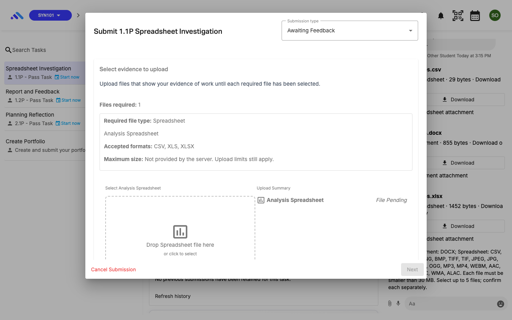
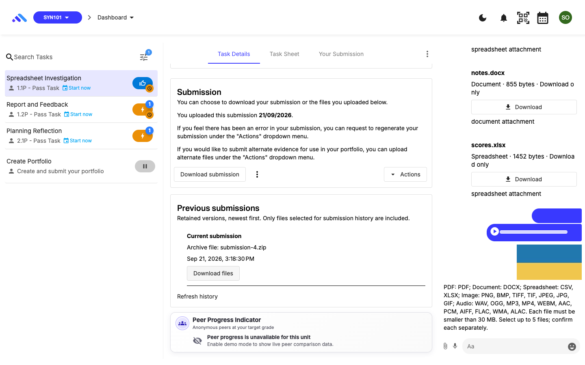
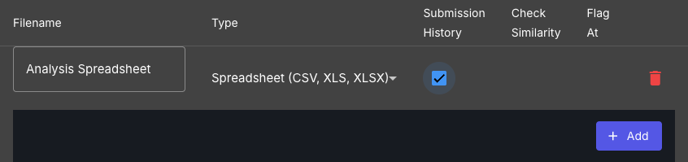

# Connected upload demonstration

Recorded 21 September 2026 with synthetic accounts and files, against web `898a1db6f7145c9f0b5ecd899957b4c758f91add` and API `7722612ef019b03bd6b4fb9319b83c52b0dac902`. This demonstrates executed behavior; it is not a human acceptance decision.

[Play the 13-second chat demonstration](evidence/upload-keyboard-demo.webm).

| Time | Actual action                                                  |
| ---- | -------------------------------------------------------------- |
| 0:00 | Write a comment draft                                          |
| 0:02 | Select XLSX, focus Cancel and press Enter; draft survives      |
| 0:05 | Select CSV and press Enter on Post Attachment; API returns 201 |
| 0:09 | Download the authorised original CSV; bytes match              |
| 0:11 | Return to the preserved draft                                  |

The file is a real browser recording with the setup/login segment trimmed and no narration. No application responses or displayed outcomes were replaced. The recording covers the chat sequence only; the executed task-processing sequence is documented below.

## Spreadsheet task submission

1. The student sees Spreadsheet guidance before file selection. An executable is rejected without a submission request.

   

2. The student selects the synthetic XLSX and submits through the actual UI. The API returns 201. The real queued application jobs run with actual TeX conversion, generating a PDF and retaining the original workbook. See [processing details and limits](evidence/processing-evidence.json).

3. The live UI reaches Awaiting Feedback and displays the current retained submission. The actual Download files button retrieves `submission-4.zip`; `000-csv.xlsx` matches the uploaded 1,452-byte workbook and its SHA-256.

   

4. The chair's named upload controls work with the keyboard. Category/history choices are restored without saving fixture changes. The Dark toolbar uses readable theme colours.

   

The checked sources preserve existing upload-policy and contributor work; attribution and boundaries remain in [the upload guide](../safe-upload-and-chat-guide.md) and [FILE-A01 matrix](../FILE-A01-safe-upload-policy-matrix.md). The [results](RESULTS.md) distinguish current browser evidence, earlier proxy evidence, remaining security follow-ups and Maple's pending decisions.

## Final PDF/image keyboard correction

The later `c3c1aa02e` fix makes the outgoing PDF label readable (6.56:1, previously1:1) and both PDF/image previews keyboard-operable. Final targeted checks pass in Chrome, Firefox and Playwright WebKit.

