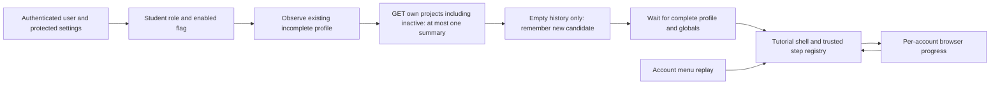

# Tutorial threat model and privacy boundary

TUT-S01. Review candidate; approval is recorded by human reviewers on the PR.

The API/session boundary authorizes the existing `/projects` request using
`current_user`. The tutorial supplies no owner parameter. It reads at most one
project summary to decide whether any enrolment exists; neither that summary nor
history results are stored in progress. The browser boundary is untrusted: progress
can be read or edited by scripts on the same origin or people sharing a browser
profile. Tutorial state grants no access or authority over units or assessment.

| Data | Purpose | Storage |
| --- | --- | --- |
| Authenticated account ID | Isolate normal account progress | Browser key namespace only; no names, emails or tokens |
| Role, authentication readiness | Exclude staff and anonymous users | Existing account memory only |
| `hasRunFirstTimeSetup` | Observe existing profile boundary | Read only; tutorial never updates it |
| `tutorialEnabled` | Institution off switch | Existing authenticated settings subject; false after sign-out/failure |
| Own project existence | No-prior-units gate | Transient response; boolean decision only; no history retained |
| Tutorial version, state, stable step | Resume, prompt suppression | Validated three-field browser record |
| DOM target position | Show current control | Transient component memory; no DOM text copied |

No detailed marks, submitted grades, feedback, extension/disability information,
assessment content, click analytics, learning history or tutorial telemetry are
stored or logged. There are no new third-party scripts, packages or remote HTML.
Copy and targets are reviewed source constants rendered with Angular text binding.

| Threat | Control and test evidence | Residual risk |
| --- | --- | --- |
| Cross-user state mutation / IDOR | No owner argument on `/projects`; account-derived storage key; account/flag generation checks discard stale history results; service isolation tests | Same-origin code and shared browser profiles can inspect non-sensitive local state. Server progress would require a new authorization design. |
| Broken/forged progress | Exact key set, bounded JSON length, integer supported version, allowlisted state/step; malformed/future records rejected; tests cover unknown and extra fields | Browser state is a usability preference, not proof of identity or authorization. |
| Profile corruption | Service has no profile update path and never writes setup fields; existing profile/welcome tests and no-action regression | Future refactors must preserve the independent setup meaning. |
| Repeated interruption | Only confirmed new candidates; once per session; skip/dismiss/complete/replay rules; bounded history timeout and no retry loop | Clearing browser storage loses progress; new browser/device is replay-only once profile setup is complete. |
| Stale target / unsafe action | Stable attributes, visible-target resolution, missing-target text, no auto clicks or route changes; all four targets tested | Manual responsive/browser review is still required when shared controls move. |
| Overlay blocks application | Modal entry/confirmation only; guided steps non-modal; Close/Escape, focus return, missing-data fallbacks | Screen reader, real browser zoom and full app route QA require explicit evidence. |
| Dependency / telemetry leak | Reuse Angular Material/CDK already in the lockfile; no additional dependency or analytics call | Existing dependency advisories are owned by the security/migration workstreams. |

A future tour package must have an explicit licence, maintenance, telemetry,
accessibility, bundle-size and supply-chain review. A future progress API requires
own-user authorization, unauthenticated/invalid/cross-user tests and a reviewed
storage justification; none is needed for this browser-only implementation.

Security tests are in `student-onboarding.service.spec.ts`,
`student-onboarding.component.spec.ts` and `doubtfire-constants.spec.ts`. These are
controls and evidence, not a claim that a security reviewer has approved rollout.
